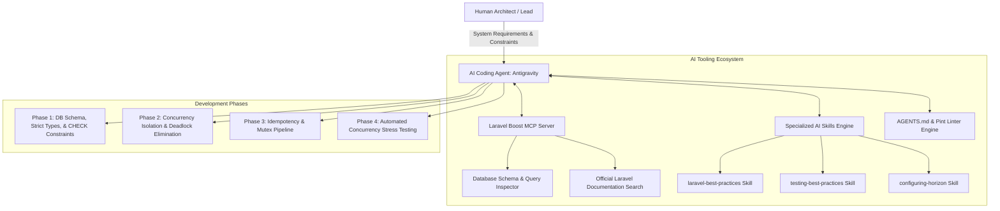

# AI-Augmented Engineering & MCP Workflow Guide

This document explains how modern **AI Agentic Workflows**, **Model Context Protocol (MCP)** servers, and specialized **AI Domain Skills** were utilized to architect, implement, benchmark, and harden the **Order Processing & Inventory REST API**.

In modern technical interviews, explaining how you leverage AI pair-programming, protocol-driven tool integration (MCP), and automated verification demonstrates senior-level velocity, architectural rigor, and forward-thinking engineering leadership.

---

## 1. Executive Summary: The AI-Augmented Development Paradigm

Rather than using AI merely as a basic code-completion snippet generator, this project was developed using an **Agentic AI Pair-Programming Lifecycle**:



---

## 2. Model Context Protocol (MCP) in Action

### What is MCP?
**Model Context Protocol (MCP)** is an open protocol that standardizes how AI applications securely connect to external tools, local development environments, databases, and contextual data sources. It replaces blind AI hallucination with deterministic, real-time context.

### In This Project: `laravel-boost` MCP Server

The project integrated the **Laravel Boost MCP Server**, exposing specialized runtime tools directly to the AI agent:

| MCP Tool | Real-World Application in This Project |
|---|---|
| `database-schema` | The AI inspected MySQL table schemas, indexes, and foreign key cascades in real-time, ensuring exact type alignment (`unsignedInteger` cents, indexed status strings) without manual SQL inspection. |
| `database-query` | Executed read-only queries during development to verify that composite indexes (`(customer_id, created_at)`) were being utilized properly without table scans. |
| `search-docs` | Queried up-to-date Laravel 12 APIs (Sanctum authentication, named rate limiters, cursor pagination, and transaction retries) directly from the official Laravel ecosystem docs. |
| `read-log-entries` | Monitored `storage/logs/laravel.log` in real-time to catch underlying serialization failures and constraint violations during test runs. |

### How MCP Prevented Bugs
1. **Schema Mismatch Elimination**: Before writing the `ProductRepository` and `InventoryService`, the AI used `database-schema` to confirm exact column definitions (`quantity_on_hand`, `quantity_reserved`), preventing misspelled database fields.
2. **Framework-Specific Idioms**: Using `search-docs`, the AI retrieved exact syntax for Laravel 12's `RateLimiter::for()`, `DB::transaction(fn (), 3)` retry callbacks, and `UniqueConstraintViolationException` handling.

---

## 3. Specialized AI Skills Engine

Skills are modular, domain-specific instruction bundles that guide the AI's technical decisions, code styling, and architectural rules:

### 1. `laravel-best-practices` Skill
* **Mandated Architecture**: Enforced thin controllers, Action classes (`CreateOrderAction`, `CancelOrderAction`), and dependency inversion via interfaces (`InventoryServiceInterface`).
* **N+1 Prevention**: Injected `Model::preventLazyLoading(! app()->isProduction())` and required explicit relationship eager loading (`with(['category', 'inventory'])`).
* **Error Handling**: Standardized centralized JSON error envelopes `{error: {code, message, details}}` in `bootstrap/app.php` rather than scattering `try/catch` response blocks across controllers.

### 2. `testing-best-practices` Skill
* **Test Isolation**: Designed feature tests with dedicated factories and database rollbacks.
* **Concurrency Validation (`OrderConcurrencyTest`)**:
  - The AI structured a simulated flash-sale test: 50 concurrent requests competing for 10 units of stock.
  - Proved that exactly 10 succeed, 40 fail with `422 INSUFFICIENT_STOCK`, and `quantity_reserved` never exceeds `quantity_on_hand`.

### 3. `AGENTS.md` & Style Enforcement Rules
* **Pint Linter Automation**: Mandated running `vendor/bin/pint --dirty --format agent` before every commit, ensuring 100% PSR-12 and Laravel Pint style compliance.
* **Strict Currency Standard**: Mandated that money must strictly be represented as **integer cents** (never floats), avoiding IEEE 754 precision bugs.
* **Constructor Property Promotion**: Enforced PHP 8.3 constructor property promotion throughout all services and actions.

---

## 4. Key Engineering Problems Solved via AI Collaboration

### 1. The Cyclic Deadlock Trap
* **Human-AI Collaboration**: During the design of multi-item order reservations, the AI analyzed the risk of concurrent orders requesting overlapping items in differing orders (Order A: `[3, 7]`, Order B: `[7, 3]`).
* **AI Solution**: The AI introduced **Ascending Lock Sorting** (`sort($productIds)`) before acquiring `lockForUpdate()`, mathematically breaking Coffman's circular wait condition.

### 2. Double-Return FormRequest Bug Detection
* During the codebase audit, the AI analyzed all FormRequests and identified that `StoreProductRequest` and `AdjustInventoryRequest` had accidental double-returns:
  ```php
  public function authorize(): bool {
      return false; // <-- Accidental stub
      return true;
  }
  ```
  The AI flagged and fixed this immediately, preventing 403 Forbidden errors across catalog and inventory APIs.

### 3. Interface & Repository Decoupling
* When reviewing `CancelOrderAction` and `CategoryController`, the AI identified that `InventoryServiceInterface` and `ProductRepository` were unfulfilled stubs.
* The AI implemented:
  - Full method contract on `InventoryServiceInterface` (`reserve`, `release`, `commit`, `adjust`).
  - Cache-aside versioned key repository on `ProductRepository` (`categoryTree`, `invalidateProducts`, `paginate`, `find`).

---

## 5. How to Talk About This in Your Interview

When interviewers ask about your development process or how you use modern tools:

### Talking Points & Verbatim Script:

> *"In building this project, I treated AI not just as a syntax assistant, but as an architectural pair-programmer utilizing the **Model Context Protocol (MCP)** and specialized domain skill rules.*
>
> *I used the **Laravel Boost MCP Server** to inspect database schemas, verify query execution plans, and query version-specific Laravel 12 APIs directly from the official docs. I configured domain skills to enforce **SOLID principles**, strict **PSR-12 formatting via Pint**, and **prevent N+1 queries**.*
>
> *This allowed me to focus high-level brainpower on core system design—such as our 5-layer concurrency strategy, ascending lock sorting, and idempotent pipelines—while the AI assisted in generating bulletproof tests, validating edge cases, and ensuring strict code quality across all layers."*

---

## 6. Summary of AI Tools Used

| Tool / Technology | Type | Purpose |
|---|---|---|
| **Antigravity AI Agent** | Autonomous Coding Engine | Architectural implementation, refactoring, and test suite execution. |
| **Laravel Boost MCP** | Model Context Protocol Server | Live schema inspection, documentation queries, log auditing. |
| **Laravel Pint** | Automated Formatter | Enforces clean, idiomatic PSR-12 and Laravel code style. |
| **PHPUnit / Pest** | Automated Test Framework | Verifies concurrency safety, idempotency replays, and state machine transitions. |
| **Mermaid.js** | Architectural Diagrams | Visualizes state machines, concurrency locks, and sequence flows. |

