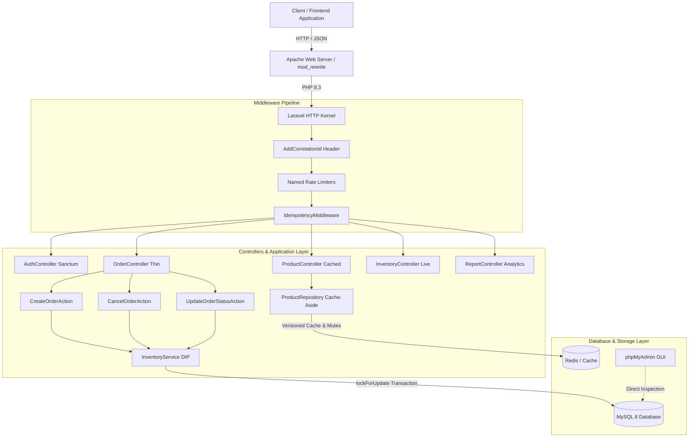
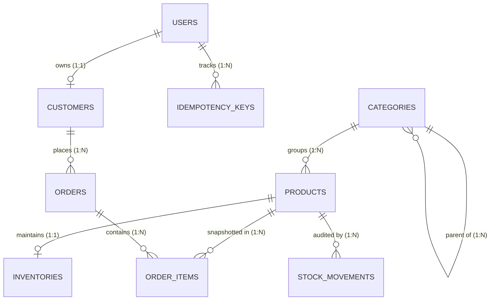

# E-Commerce Order Processing & Inventory REST API

A production-grade, highly concurrent **E-commerce Order Processing & Inventory REST API** built with **Laravel 12 (PHP 8.3)**, **MySQL 8**, **Redis**, and **Sanctum**.

---

## Architecture Overview



---

## 1. Local Setup Instructions (Apache & phpMyAdmin)

This project is tailored for local development using **Apache** and **phpMyAdmin** with **MySQL 8**.

### Prerequisites
- PHP 8.3 with extensions (`pdo_mysql`, `mbstring`, `bcmath`, `curl`, `zip`)
- MySQL 8.0+
- Apache with `mod_rewrite` enabled
- phpMyAdmin

---

### Step-by-Step Local Setup

#### Step 1: Create Database via phpMyAdmin
1. Open phpMyAdmin in your browser (`http://localhost/phpmyadmin`).
2. Click **New** in the left sidebar.
3. Set Database Name to: `order_inventory`.
4. Choose Collation: `utf8mb4_unicode_ci`.
5. Click **Create**.

---

#### Step 2: Configure Environment (`.env`)
Copy the environment template and configure your MySQL credentials:

```bash
cp .env.example .env
```

Update the database section in `.env`:
```env
APP_NAME="Order & Inventory API"
APP_ENV=local
APP_DEBUG=true
APP_URL=http://localhost/order-inventory-api/public

DB_CONNECTION=mysql
DB_HOST=127.0.0.1
DB_PORT=3306
DB_DATABASE=order_inventory
DB_USERNAME=root
DB_PASSWORD=

CACHE_STORE=redis
# For local environments without Redis, set CACHE_STORE=file or database:
# CACHE_STORE=file

QUEUE_CONNECTION=database
```

Generate the application encryption key:
```bash
php artisan key:generate
```

---

#### Step 3: Run Migrations and Seeders
Run migrations to build all tables, indexes, and CHECK constraints, followed by bulk seeding:

```bash
php artisan migrate:fresh --seed
```

This populates:
- **Admin user**: `admin@example.com` / password `password`
- **Categories**: 20 categories
- **Products & Inventory**: 10,000 products with on-hand stock and tracking ledgers
- **Customers**: 1,000 customer accounts
- **Orders & Items**: 100,000 historical orders with itemized price snapshots

---

#### Step 4: Configure Apache VirtualHost (Optional but Recommended)
If using Apache VirtualHost:
```apache
<VirtualHost *:80>
    ServerName order-api.local
    DocumentRoot "/path/to/order-inventory-api/public"
    <Directory "/path/to/order-inventory-api/public">
        AllowOverride All
        Require all granted
    </Directory>
</VirtualHost>
```

Or access directly via Apache directory alias / localhost subfolder:
```
http://localhost/order-inventory-api/public/api/v1/products
```

The bundled `public/.htaccess` file automatically handles URL rewriting to `index.php`.

---

## 2. Database Schema & Architecture Explanation



### Table Structure & Design Principles

1. **`users`**:
   - `id`, `name`, `email` (unique), `password`, `role` (`admin` or `customer`), timestamps.
   - Powers Sanctum API token authentication and policy-based authorization.

2. **`customers`**:
   - `id`, `user_id` (foreign key to `users.id`, nullable, unique), `name`, `email` (unique), `phone`, timestamps.
   - Separates customer CRM details from authentication credentials.

3. **`categories`**:
   - `id`, `parent_id` (foreign key to `categories.id`, nullable for category trees), `name`, `slug` (unique), timestamps.

4. **`products`**:
   - `id`, `category_id`, `sku` (unique, 64-char indexed), `name`, `description`, `price` (stored as **integer cents**), `is_active` (boolean), `deleted_at` (soft deletes), timestamps.
   - **Composite Index**: `(category_id, is_active)` for catalog browsing.
   - **FULLTEXT Index**: `products(name)` for search.

5. **`inventories`**:
   - `id`, `product_id` (unique, foreign key to `products.id`), `quantity_on_hand`, `quantity_reserved`, `version` (unsigned int for optimistic concurrency support), timestamps.
   - **Database CHECK Constraint**:
     ```sql
     ALTER TABLE inventories ADD CONSTRAINT chk_inv_reserved_lte_on_hand CHECK (quantity_reserved <= quantity_on_hand);
     ```
   - Guarantees at the database engine level that reservations cannot exceed available physical stock.

6. **`stock_movements` (Audit Ledger)**:
   - `id`, `product_id`, `type` (`in`, `out`, `reserve`, `release`, `commit`), `quantity` (signed integer delta), `reference_type` / `reference_id` (polymorphic order relation), `note`, `created_at`.
   - Immutable append-only audit trail for every inventory modification.

7. **`orders`**:
   - `id`, `customer_id`, `idempotency_key` (unique, 64 chars), `status` (`pending`, `confirmed`, `processing`, `shipped`, `delivered`, `cancelled`), `total` (cents), `placed_at`, `cancelled_at`, timestamps.
   - **Composite Indexes**: `(customer_id, created_at)` and `(status, created_at)`.

8. **`order_items`**:
   - `id`, `order_id`, `product_id`, `quantity`, `unit_price` (historical unit price snapshotted in cents), `line_total` (cents).
   - Historical orders preserve exact sales value even if product prices subsequently change.

9. **`idempotency_keys`**:
   - `id`, `user_id`, `key`, `request_hash`, `status_code`, `response_body` (cached response), `locked_at`, `expires_at`, timestamps.
   - Unique composite index on `(user_id, key)`.

---

## 3. API Documentation with Sample Requests & Responses

### Authentication Endpoints

#### Register Customer
```http
POST /api/v1/auth/register HTTP/1.1
Content-Type: application/json

{
  "name": "Jane Doe",
  "email": "jane@example.com",
  "password": "password123",
  "password_confirmation": "password123",
  "phone": "+1-555-0199"
}
```
**Response (201 Created):**
```json
{
  "data": {
    "id": 2,
    "name": "Jane Doe",
    "email": "jane@example.com",
    "role": "customer"
  },
  "token": "2|r9T8y7U6i5O4p3A2s1D..."
}
```

#### Login
```http
POST /api/v1/auth/login HTTP/1.1
Content-Type: application/json

{
  "email": "admin@example.com",
  "password": "password"
}
```
**Response (200 OK):**
```json
{
  "data": {
    "id": 1,
    "name": "Admin User",
    "email": "admin@example.com",
    "role": "admin"
  },
  "token": "1|qW3E4r5T6y7U8i9O0p..."
}
```

---

### Product Catalog Endpoints

#### List Products (Filtered & Paginated)
```http
GET /api/v1/products?category_id=1&min_price=1000&max_price=20000&sort=-price&per_page=15 HTTP/1.1
```
**Response (200 OK):**
```json
{
  "data": [
    {
      "id": 105,
      "sku": "SKU-000105",
      "name": "Product 105",
      "description": null,
      "price": 19500,
      "is_active": true,
      "category": {
        "id": 1,
        "parent_id": null,
        "name": "Category 1",
        "slug": "category-1"
      },
      "stock": {
        "on_hand": 340,
        "reserved": 0,
        "available": 340
      },
      "created_at": "2026-10-03T18:00:00Z"
    }
  ],
  "links": { ... },
  "meta": { ... }
}
```

---

### Order Processing Endpoints

#### Create Order (Requires `Idempotency-Key`)
```http
POST /api/v1/orders HTTP/1.1
Authorization: Bearer 1|qW3E4r5T6y7U8i9O0p...
Idempotency-Key: 9b2d8f76-c2a4-4a2e-8d5b-1c3e4f5a6b7c
Content-Type: application/json

{
  "items": [
    { "product_id": 1, "quantity": 2 },
    { "product_id": 5, "quantity": 1 }
  ]
}
```
**Response (201 Created):**
```json
{
  "data": {
    "id": 100001,
    "status": "pending",
    "total": 3500,
    "idempotency_key": "9b2d8f76-c2a4-4a2e-8d5b-1c3e4f5a6b7c",
    "customer": {
      "id": 1,
      "name": "Customer 1",
      "email": "customer1@example.com"
    },
    "items": [
      {
        "product_id": 1,
        "sku": "SKU-000001",
        "name": "Product 1",
        "quantity": 2,
        "unit_price": 1000,
        "line_total": 2000
      },
      {
        "product_id": 5,
        "sku": "SKU-000005",
        "name": "Product 5",
        "quantity": 1,
        "unit_price": 1500,
        "line_total": 1500
      }
    ],
    "placed_at": "2026-10-04T10:00:00Z",
    "cancelled_at": null,
    "created_at": "2026-10-04T10:00:00Z"
  }
}
```

#### Replaying with Same Idempotency-Key & Same Payload
Sending the exact same request above returns the cached response with header `Idempotent-Replayed: true` without running database transactions or deducting stock a second time.

#### Replaying with Same Idempotency-Key & Different Payload
Returns HTTP `422 Unprocessable Entity`:
```json
{
  "error": {
    "code": "IDEMPOTENCY_KEY_REUSED",
    "message": "Idempotency-Key was reused with a different request payload.",
    "details": {}
  }
}
```

#### Cancel Order
```http
POST /api/v1/orders/100001/cancel HTTP/1.1
Authorization: Bearer 1|qW3E4r5T6y7U8i9O0p...
```
**Response (200 OK):**
```json
{
  "data": {
    "id": 100001,
    "status": "cancelled",
    "cancelled_at": "2026-10-04T10:05:00Z"
  }
}
```

#### Update Order Status (Admin Only)
```http
PATCH /api/v1/orders/100001/status HTTP/1.1
Authorization: Bearer 1|qW3E4r5T6y7U8i9O0p...
Content-Type: application/json

{
  "status": "confirmed"
}
```

---

### Reports & Inventory Endpoints

#### Low Stock Report
```http
GET /api/v1/inventory/low-stock?threshold=10 HTTP/1.1
Authorization: Bearer 1|qW3E4r5T6y7U8i9O0p...
```

#### Daily Sales Report
```http
GET /api/v1/reports/sales?from=2026-09-01&to=2026-09-30 HTTP/1.1
Authorization: Bearer 1|qW3E4r5T6y7U8i9O0p...
```
**Response (200 OK):**
```json
{
  "data": [
    { "day": "2026-09-01", "orders": 420, "revenue": 1450200 },
    { "day": "2026-09-02", "orders": 512, "revenue": 1823400 }
  ],
  "meta": { "from": "2026-09-01", "to": "2026-09-30" }
}
```

---

## 4. Caching Strategy and Invalidation

### Cache Layers & TTLs
1. **Product Detail**: `products:v{version}:detail:{id}` (TTL: 60 seconds).
2. **Product Filtered Lists**: `products:v{version}:list:{md5_hash_of_filters_and_page}` (TTL: 30 seconds).
3. **Category Tree**: `categories:tree` (TTL: 3600 seconds).

### Invalidation Mechanics
- **Versioned Keys**: Rather than clearing hundreds of individual cache keys or relying on Redis tags (which fail on distributed Redis clusters), the repository maintains a single integer key `products:version`.
- **Atomic Cache Bump**: Calling `$productRepository->invalidateProducts()` increments `products:version`. All subsequent reads immediately point to the incremented namespace, instantaneously invalidating cold cached lists and detail views without blocking Redis.
- **Mutex Stampede Protection**: Cold cache queries acquire a Redis mutex lock (`Cache::lock("lock:{$key}", 5)`). If 1,000 parallel clients request an expired product page simultaneously, exactly **one client** queries MySQL to populate the cache while the remaining 999 wait on the lock for the cached value.
- **CRITICAL STOCK ISOLATION RULE**: Stock quantities attached to product catalog responses are cached purely for frontend display. **Cached stock is NEVER used to make reservation decisions.** Reservation decisions query locked database rows (`lockForUpdate()`) strictly inside active DB transactions.

---

## 5. Database Optimization and Indexing

### High-Performance Indexing Strategy
1. **`orders(customer_id, created_at)`**:
   - Eliminates filesort operations when fetching customer order histories sorted by recent dates.
2. **`orders(status, created_at)`**:
   - Accelerates admin status lookups and powers the scheduled job releasing expired reservations (`status = 'pending' AND placed_at < 15 min ago`).
3. **`products(category_id, is_active)`**:
   - Allows index-only lookups for active products within a selected category.
4. **`products(price)`**:
   - Accelerates catalog price filtering and sorting.
5. **FULLTEXT `products(name)`**:
   - Provides performant full-text searches across large product catalogs without slow leading wildcard `LIKE '%term%'` full table scans.

### Cursor Pagination for Order Histories
On a dataset of 100,000+ orders, traditional offset pagination (`LIMIT 15 OFFSET 95000`) forces MySQL to scan and discard 95,000 rows. This API utilizes **cursor pagination** (`cursorPaginate()`), using the indexed `(created_at, id)` tuple to query:
```sql
WHERE (created_at, id) < (?, ?) ORDER BY created_at DESC, id DESC LIMIT 15;
```
This guarantees constant $O(1)$ query execution time regardless of pagination depth.

---

## 6. System Design Explanation & Key Technical Decisions

### Concurrency & Deadlock Prevention
- **Pessimistic Locking (`lockForUpdate()`)**:
  - When reserving stock, inventory rows are locked using `lockForUpdate()`.
- **Sorted Lock Acquisition**:
  - Multi-item orders lock rows sorted by `product_id` in ascending order (`sort($productIds)`). Two concurrent orders containing overlapping products (e.g., Order A with products [3, 7] and Order B with products [7, 3]) will both lock 3 first, then 7. This completely eliminates cyclic wait deadlocks.
- **Order-First Locking on Status/Cancel**:
  - Order cancellation and status progression lock the `orders` row first, followed by inventory rows, guaranteeing deterministic locking hierarchy across all application paths.
- **Automatic Transaction Deadlock Retries**:
  - Critical actions are wrapped in `DB::transaction(fn (), 3)` to gracefully retry and recover in the event of transient database serialization conflicts.

### State Machine in `OrderStatus` Enum
Order lifecycle transitions are strictly governed within the `OrderStatus` PHP enum:
- `Pending` → `Confirmed`, `Cancelled`
- `Confirmed` → `Processing`, `Cancelled`
- `Processing` → `Shipped`
- `Shipped` → `Delivered`
- `Delivered`, `Cancelled` → Final (no further transitions allowed)

Illegal status transitions immediately throw an `InvalidOrderTransitionException`, rendered as HTTP 422 with the list of allowable transitions.

### Clean Architecture & SOLID Principles
- **Thin Controllers**: Controllers contain no business logic; they only validate requests, pass inputs to dedicated Action classes, and format responses via API Resources.
- **Dependency Inversion Principle (DIP)**: `CreateOrderAction`, `CancelOrderAction`, and `InventoryController` depend on `InventoryServiceInterface`, bound in `AppServiceProvider`.
- **Consistent Error Responses**: All domain exceptions (`ApiException`, `InsufficientStockException`, `IdempotencyConflictException`, `ValidationException`) are centralized in `bootstrap/app.php` and mapped to a uniform JSON envelope:
  ```json
  {
    "error": {
      "code": "ERROR_CODE",
      "message": "Human readable message",
      "details": {}
    }
  }
  ```

---

## 7. Running Verification & Automated Tests

Run the full PHPUnit test suite:
```bash
php artisan test
```

### Verified Test Cases:
- `OrderCreationTest`: Authentication enforcement, required idempotency key, order creation & stock reservation.
- `OrderCancellationTest`: Customer cancellation releases reserved stock; prevents cancelling delivered orders.
- `IdempotencyTest`: Deterministic replay of stored responses, detection and rejection of reused keys with altered payloads.
- `OrderStatusTransitionTest`: Unit tests verifying allowable and forbidden state machine transitions.
- `InventoryServiceTest`: Unit tests for pessimistic stock reservations and insufficient stock exceptions.
- `OrderConcurrencyTest`: Simulates 50 parallel order requests for 10 units of stock; proves exactly 10 succeed and reserved stock never exceeds on-hand stock.
