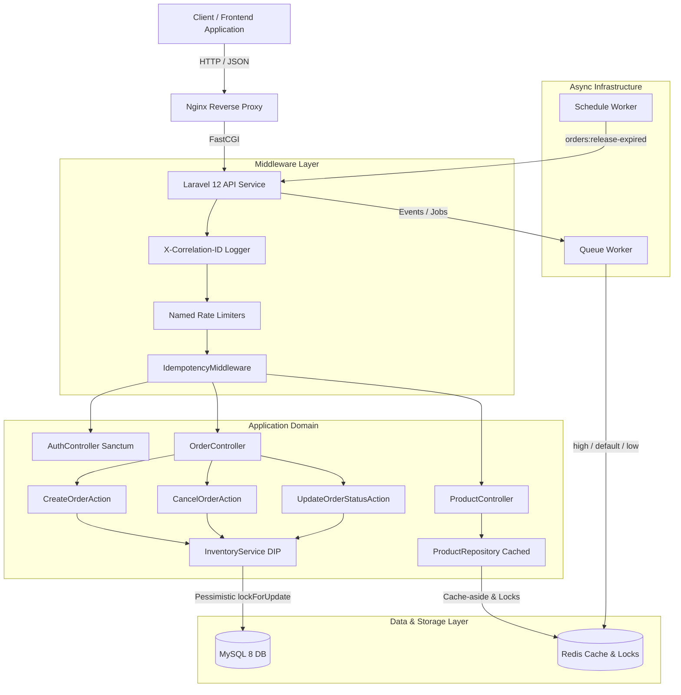
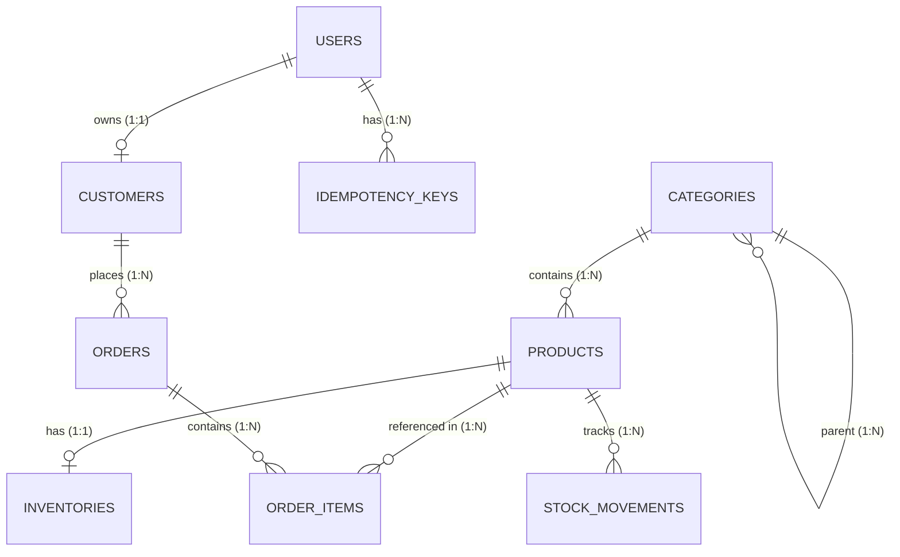

# E-Commerce Order Processing & Inventory REST API

A production-grade, highly concurrent **E-commerce Order Processing & Inventory REST API** built with **Laravel 12 (PHP 8.3)**, **MySQL 8**, **Redis**, and **Sanctum**.

---

## Architecture Diagram



---

## 1. Setup Instructions

### Prerequisites
- Docker & Docker Compose (for Containerized Setup)
- PHP 8.3+, Composer, MySQL 8+, Redis (for Native Local Setup)

### Quickstart with Docker Compose

```bash
# 1. Clone repository and navigate to directory
cd order-inventory-api

# 2. Copy environment configuration
cp .env.example .env

# 3. Start containers in detached mode
docker-compose up -d --build

# 4. Generate application key
docker-compose exec app php artisan key:generate

# 5. Run migrations and seed database (10,000 products, 100,000 orders)
docker-compose exec app php artisan migrate:fresh --seed
```

### Local Setup (Native PHP/Composer)

```bash
# 1. Install dependencies
composer install

# 2. Configure .env database credentials
cp .env.example .env
php artisan key:generate

# 3. Execute migrations and volume seeding
php artisan migrate:fresh --seed

# 4. Run tests
php artisan test

# 5. Start local server
php artisan serve
```

---

## 2. Database Schema & ERD



### Field Breakdown & Constraints

- **`users`**: `id`, `name`, `email` (unique), `password`, `role` (enum: `admin`, `customer`), `timestamps`.
- **`customers`**: `id`, `user_id` (nullable, unique), `name`, `email` (unique), `phone`, `timestamps`.
- **`categories`**: `id`, `parent_id` (foreign key to `categories.id`, `nullOnDelete`), `name`, `slug` (unique), `timestamps`.
- **`products`**: `id`, `category_id`, `sku` (unique, 64 chars), `name`, `description`, `price` (integer cents), `is_active`, `timestamps`, `softDeletes`.
- **`inventories`**: `id`, `product_id` (unique), `quantity_on_hand` (unsigned int), `quantity_reserved` (unsigned int), `version` (unsigned int), `timestamps`.
  - **DB Constraint**: `CHECK (quantity_reserved <= quantity_on_hand)`
- **`stock_movements`**: `id`, `product_id`, `type` (`in`, `out`, `reserve`, `release`, `commit`), `quantity` (signed int), `reference_type`/`reference_id` (polymorphic order link), `note`, `created_at`.
- **`orders`**: `id`, `customer_id`, `idempotency_key` (unique, 64 chars), `status` (enum: `pending`, `confirmed`, `processing`, `shipped`, `delivered`, `cancelled`), `total` (unsigned big int cents), `placed_at`, `cancelled_at`, `timestamps`.
- **`order_items`**: `id`, `order_id`, `product_id`, `quantity`, `unit_price` (snapshot cents), `line_total` (cents).
- **`idempotency_keys`**: `id`, `user_id`, `key`, `request_hash`, `status_code`, `response_body`, `locked_at`, `expires_at`, `timestamps`. Unique index on `(user_id, key)`.

---

## 3. API Documentation & Sample Payloads

### Authentication
- `POST /api/v1/auth/register` - Create customer account & return Sanctum bearer token.
- `POST /api/v1/auth/login` - Authenticate credentials & return bearer token.
- `POST /api/v1/auth/logout` - Revoke current API token.
- `GET /api/v1/auth/me` - Fetch authenticated user details.

#### Sample Login Request:
```json
POST /api/v1/auth/login
Content-Type: application/json

{
  "email": "admin@example.com",
  "password": "password"
}
```

#### Sample Response (200 OK):
```json
{
  "data": {
    "id": 1,
    "name": "Admin User",
    "email": "admin@example.com",
    "role": "admin"
  },
  "token": "1|qW3E4r5T6y7U8i9O0p..."
}
```

---

### Orders API

- `POST /api/v1/orders` (Requires `Idempotency-Key` Header) - Create order & reserve stock under lock.
- `GET /api/v1/orders` - Cursor-paginated user order history.
- `GET /api/v1/orders/{id}` - View order details.
- `POST /api/v1/orders/{id}/cancel` - Cancel order & release stock.
- `PATCH /api/v1/orders/{id}/status` (Admin Only) - State machine status progression.

#### Sample Create Order Request:
```http
POST /api/v1/orders HTTP/1.1
Authorization: Bearer 1|qW3E4r5T6y7U8i9O0p...
Idempotency-Key: e9a3b8c4-7d2e-4f1a-8b9c-0d1e2f3a4b5c
Content-Type: application/json

{
  "items": [
    { "product_id": 1, "quantity": 2 },
    { "product_id": 4, "quantity": 1 }
  ]
}
```

#### Sample Create Order Response (201 Created):
```json
{
  "data": {
    "id": 100001,
    "status": "pending",
    "total": 3500,
    "idempotency_key": "e9a3b8c4-7d2e-4f1a-8b9c-0d1e2f3a4b5c",
    "customer": {
      "id": 1,
      "name": "Customer 1",
      "email": "customer1@example.com",
      "phone": null
    },
    "items": [
      {
        "product_id": 1,
        "sku": "SKU-000001",
        "name": "Product 1",
        "quantity": 2,
        "unit_price": 1000,
        "line_total": 2000
      },
      {
        "product_id": 4,
        "sku": "SKU-000004",
        "name": "Product 4",
        "quantity": 1,
        "unit_price": 1500,
        "line_total": 1500
      }
    ],
    "placed_at": "2026-10-03T23:00:00+00:00",
    "cancelled_at": null,
    "created_at": "2026-10-03T23:00:00+00:00"
  }
}
```

---

### Errors (Consistent Format)

All error responses return HTTP status codes with a consistent JSON body structure `{error: {code, message, details}}`:

#### Sample 409 Insufficient Stock Error:
```json
{
  "error": {
    "code": "INSUFFICIENT_STOCK",
    "message": "Insufficient stock for one or more products.",
    "details": {
      "product_id": 1,
      "requested": 50,
      "available": 5
    }
  }
}
```

#### Sample 422 Invalid Status Transition Error:
```json
{
  "error": {
    "code": "INVALID_STATUS_TRANSITION",
    "message": "Cannot transition order from delivered to cancelled.",
    "details": {
      "from": "delivered",
      "to": "cancelled",
      "allowed": []
    }
  }
}
```

---

## 4. Caching Strategy & Invalidation Rules

### Redis Cache Layers
1. **Product Detail**: Key `products:v{ver}:detail:{id}` (TTL: 60s).
2. **Product Lists / Search**: Key `products:v{ver}:list:{hash}` (TTL: 30s) including filter query parameters.
3. **Category Tree**: Key `categories:tree` (TTL: 3600s).

### Cache Invalidation Rules
- **Versioned Keys**: Instead of relying on Redis tags (which are unsupported in clustered Redis mode), cache invalidation increments `products:version` in Redis.
- **Immediate Write Invalidation**: Any product creation, update, deletion, or stock adjustment triggers `invalidateProducts()`, incrementing the version counter and rendering older list/detail keys cold.
- **Stampede Lock Guard**: Reads use `Cache::lock("lock:{key}")->block(5, ...)` to ensure that when a cached key expires under high concurrency, exactly **one worker** executes the DB query to refresh the cache while concurrent requests wait briefly for the warm cache.
- **CRITICAL STOCK RULE**: Stock displayed in API product responses is cached for display purposes only. **Cached stock is NEVER used for order reservation decisions.** Stock availability is strictly computed under database row locks (`lockForUpdate()`) inside a transaction.

---

## 5. Database Optimization & Indexing Strategy

1. **Deadlock-Free Lock Ordering**:
   - In order creation and stock modifications, `inventories` rows are always fetched using `orderBy('product_id')` with `lockForUpdate()`. Sorting product IDs before locking guarantees that parallel orders containing overlapping items acquire locks in the exact same sequence, eliminating cyclic wait deadlocks.
2. **Order & Status Locking**:
   - Order cancellation and status updates lock the `orders` row first before acquiring inventory locks, maintaining a deterministic multi-table locking order across the system.
3. **Optimized Indexes**:
   - `orders(customer_id, created_at)`: Speeds up customer order history lookups.
   - `orders(status, created_at)`: Optimizes admin status filtering & scheduled expiration queries.
   - `products(category_id, is_active)`: Accelerates filtered product catalog browsing.
   - `products(price)`: Supports fast range filtering.
   - `FULLTEXT products(name)`: Enables high-performance full-text search.
4. **Cursor Pagination**:
   - Orders list API uses `cursorPaginate()`, avoiding high-offset `OFFSET N` performance degradation on large datasets (100k+ orders).

---

## 6. System Design & Technical Decisions

- **Single Responsibility & Dependency Inversion**:
  - Thin controllers delegate state changes to dedicated actions (`CreateOrderAction`, `CancelOrderAction`, `UpdateOrderStatusAction`).
  - `InventoryService` sits behind `InventoryServiceInterface`, registered in `AppServiceProvider`.
- **State Machine Integrity**:
  - Enforced directly in `OrderStatus` enum via `allowedTransitions()`:
    - `pending` → `confirmed`, `cancelled`
    - `confirmed` → `processing`, `cancelled`
    - `processing` → `shipped`
    - `shipped` → `delivered`
    - `delivered`, `cancelled` → Final states (no transitions permitted)
- **Idempotency Architecture**:
  - `IdempotencyMiddleware` guards `POST /orders`.
  - Atomicity is ensured using Redis `Cache::lock` to prevent concurrent duplicate in-flight requests.
  - Payloads are checked against SHA-256 hashes of previous executions. Replaying the same key and payload returns the original stored response headers and body without executing business logic twice.
